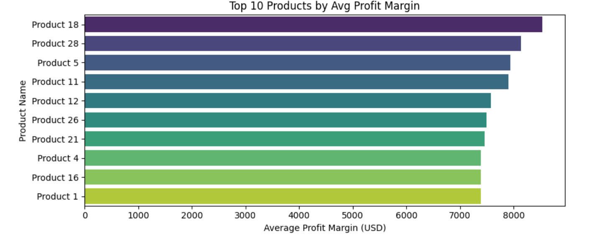
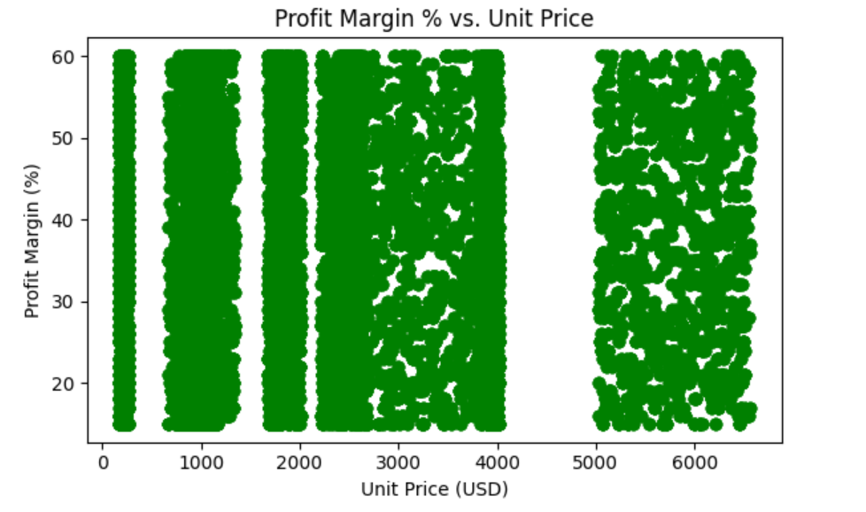
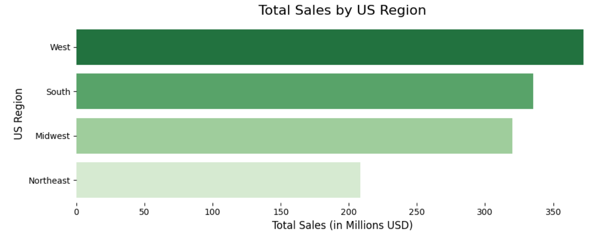
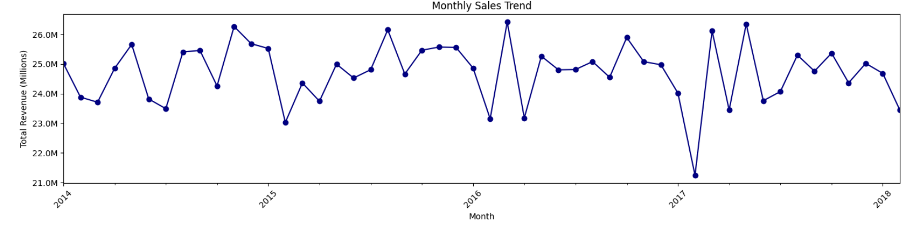

# 📊 Regional Sales Performance Analysis (2014–2018)

  
  
  
  
  
  

---

## 🚀 Project Overview

A **data-driven Exploratory Data Analysis (EDA)** project analyzing multi-year sales performance across the United States (2014–2018).

This project uncovers:

* Revenue drivers
* Profitability patterns
* Regional performance
* Budget vs actual insights

---

## 🎯 Key Highlights

✔️ Identified **80/20 revenue concentration (Pareto Principle)**
✔️ Discovered **tiered pricing strategy using margin clustering**
✔️ Analyzed **regional growth & budget alignment**
✔️ Detected **seasonal trends & anomalies**
✔️ Delivered **business-ready recommendations**

---

## 📂 Dataset Overview

| Dataset      | Description                   |
| ------------ | ----------------------------- |
| Sales Orders | Transaction-level sales data  |
| Customers    | Customer segmentation         |
| Products     | Product categories & pricing  |
| Regions      | Geographic classification     |
| Budget       | Planned vs actual performance |

---

## 🛠️ Tech Stack

* **Language:** Python
* **Libraries:** Pandas, NumPy, Matplotlib, Seaborn
* **Concepts:** Data Cleaning, Feature Engineering, EDA, Business Analytics

---

## 🔄 Data Workflow

[Raw Excel Data] → [Data Cleaning] → [Feature Engineering] → [Data Merging] → [Master Dataset] → [EDA & Visualization] → [Insights & Recommendations]

---

## 📊 Key Visualizations

### 📈 Top Products by Profit Margin (%)

---

### 💰 Profit Margin vs Unit Price

---

### 🌍 Regional Revenue Distribution

---

### 📅 Monthly Sales Trend

---

## 🔍 Key Insights

### 1️⃣ Revenue Concentration

* Top 5 products contribute ~80% revenue
* Long tail of low-performing products

📌 **Recommendation:** Focus on high-performing SKUs

---

### 2️⃣ Pricing Strategy

* Profit margins: **18% – 60%**
* Clear clustering → **tiered pricing model**

📌 **Recommendation:** Optimize mid-tier pricing

---

### 3️⃣ Regional Performance

* California contributes **20%+ revenue**
* Budget vs Actual mismatch observed

📌 **Recommendation:** Improve budget allocation

---

### 4️⃣ Seasonality & Anomaly

* Peak: **May–June**
* Dip: ~$21.2M in early 2017

📌 **Recommendation:** Investigate anomaly

---

## 📈 Business Impact

* Better **product portfolio decisions**
* Improved **pricing strategy insights**
* Data-driven **budget planning**
* Early detection of **performance issues**

---

## 📎 Future Enhancements

* 📊 Build Power BI / Tableau Dashboard
* 🔮 Sales Forecasting using ML
* 👥 Customer Segmentation (RFM Analysis)

---

## 💼 Recruiter Note

This project demonstrates:

✔️ Strong analytical thinking
✔️ Business insight generation
✔️ Hands-on EDA experience
✔️ Industry-relevant skills

**Suitable for:**

* Data Analyst
* Business Analyst
* Market Intelligence Roles

---

## ⭐ Support

If you found this useful, consider giving it a ⭐ on GitHub!
